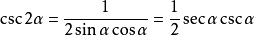
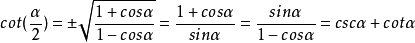
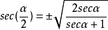

# 三角函数 #

## 定义 ##

### 直角三角形三角函数定义 ###

基本函数|英文|缩写|表达式|语言描述
---|
正弦函数|sine|sin|a/c|∠A的对边比斜边
余弦函数|cosine|cos|b/c|∠A的邻边比斜边
正切函数|tangent|tan|a/b|∠A的对边比邻边
余切函数|cotangent|cot|b/a|∠A的邻边比对边
正割函数|secant|sec|c/b|∠A的斜边比邻边
余割函数|cosecant|csc|c/a|∠A的斜边比对边

### 基本三角函数关系的速记方法 ###

如上图，六边形的六个角分别代表六种三角函数，存在如下关系：

1. 对角相乘乘积为1，即sinθ·cscθ=1； cosθ·secθ=1； tanθ·cotθ=1。

2. 六边形任意相邻的三个顶点代表的三角函数，处于中间位置的函数值等于与它相邻两个函数值的乘积，如：sinθ=cosθ·tanθ；tanθ=sinθ·secθ...

3. 阴影部分的三角形，处于上方两个顶点的平方之和等于下顶点的平方值，如：

	1. 
	2. 
	3. 

## 关于三角恒等式 ##

### 两角和与差 ###

1. 
2. 
3. 
4. 
5. 
6. 

TODO:写证明过程

### 和差化积 ###

1. 
2. 
3. 
4. 

### 积化和差 ###

1. 
2. 
3. 
4. 

### 二倍角公式 ###

1. 
2. 
3. 
4. 
5. 
6. 

### 半角公式 ###

1. 
1. 
1. 
1. 
1. 
1. 

## 参考资料 ##

[1. 三角函数（数学名词）_百度百科](https://baike.baidu.com/item/三角函数/1652457)

[2. 三角函数公式_百度百科](https://baike.baidu.com/item/三角函数公式/4374733)

